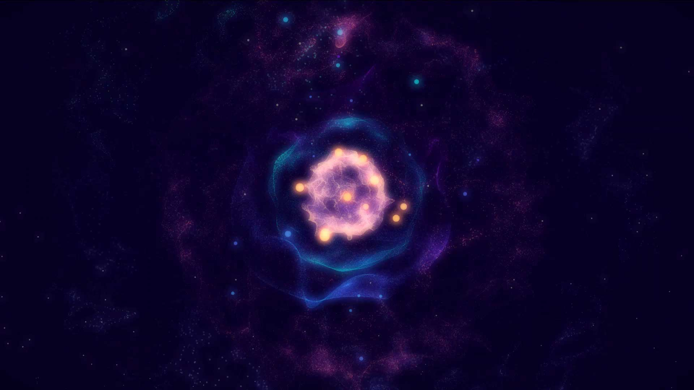

# Celestial Bodies

<a href="https://theogil.github.io/celestial-bodies/" target="_blank">Check out the live version in your browser! 🌟</a>

## What

ThreeJS Experiment.

Basically tons of particles positioned of the surface of concentric spheres.

Their opacity, scale and color are modulated by noise.

Apply bloom, et voila.

## How

Install dependencies

```sh
npm install
```

Run

```sh
npm run start
```

Open `localhost:1234` in your browser. Have fun!
