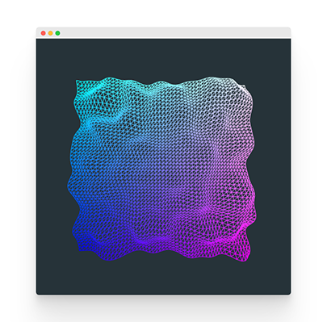

# threejs-starter

A basic and opiniated threejs starter to quickstart prototyping.
Spend less time on configuration and more time on the fun part!

Install dependencies

```sh
npm install
```

Run

```sh
npm run start
```

Build

```sh
npm run build-prod
```
